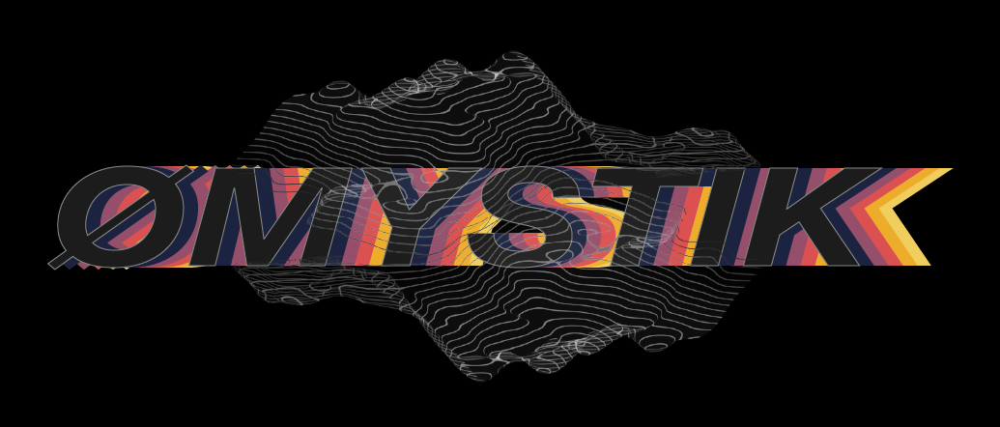

<div align="center">



<br>
<br>
<br>

**An open source peer-to-peer mesh that paves the way for productivity in a private setting while in extreme environment:<br>
carries and computes data it cannot read, for peers it does not trust.**


[](LICENSING.md)
[](SECURITY.md)
[](DUAL_USE.md)

</div>

---
> <br> **⚠️ IMPORTANT**
<br><br>
> **Pre-production and unaudited.**
<br> ØMYSTIK has not undergone independent security or
> cryptographic review, and the default build enables an `insecure` feature flag. Do not
> use it to protect data whose disclosure would harm someone. See
> [SECURITY.md](SECURITY.md).
>
> **Dual-use technology.**
<br> This software is documented for both civil and defense
> applications, incorporates strong cryptography -- [ZAMA's TFHE and MPC](https://csrc.nist.gov/csrc/media/presentations/2026/mpts2026-2b3/images-media/mpts2026-2b3-slides-zama-fhe-smart.pdf) -- which has been submitted to [NIST's theshold cryptography call](https://csrc.nist.gov/projects/threshold-cryptography). Read [DUAL_USE.md](DUAL_USE.md) before deploying.
>
> **License BSD-3-Clause-Clear: research and development vs commercial use**
<br> ØMYSTIK builds on ZAMA's TFHE and KMS stack. While research and development are free of use, commercial use requires a ZAMA agreement. See [LICENSING.md](LICENSING.md).

---
<br>

## How it works

Networks in the field are interfered with, jammed, attacked, and cut. One usual answer
encrypts data in transit and at rest, then decrypts it to do anything useful, exposing it
at exactly the moment it matters.

ØMYSTIK takes a different approach. Each terminal, laptop, phone, server, vehicle, UxV,
sensor becomes a node in an encrypted mesh that has no knowledge of the transiting data.

- **Layer 0 - MYSTIK>P2P** ([see lineage.](#Lineage))
  - *autonomous discovery*: nodes join the mesh through rendezvous points; stored content
    and key replicas are located through the Kademlia DHT.
  - *persistently stores without reading*: files are encrypted with XChaCha20Poly1305
    before they touch disk, and their metadata are hashed into a Merkle root (MID).
    Users locate a file by knowing its metadata; the mesh keeps no copy of the
    decryption key.

- **Layer 1 - computes without decrypting**
  - executors run *smart programs* over ciphertext with an evaluation key only: they
    cannot read their own inputs or outputs.
  - programs have a stable identity, a manifest and a typed ABI, and can consume
    live encrypted inputs over a session.

- **Layer 2 - decrypts only by quorum**
  - FHE keys are generated and held in threshold across independent MPC parties
    (Zama's KMS, moved from gRPC to libp2p): no single party can decrypt.
  - the key mesh is reachable only through a gateway that aggregates partial results
    but holds no share and never sees an MPC round.

## Roadmap
- **Layer 3 - physarum solver** in `/mesh-c`
  - computing needs are channelled toward computing nodes, instead of executors being
    dialled from configuration.

- **Layer 4 - `/mesh-p`**
  - a mesh of gateway nodes, so that Pylon is no longer a single bottleneck.

- **Layer 5 - self-repairing mesh**
  - the mesh rebalances itself according to the roles its nodes need to fill.

- **Layer 6 - Decentralized IDentification**

Built on major open sources development: Protocol Labs' [rust-libp2p](https://github.com/libp2p/rust-libp2p),
[ZAMA's KMS](https://github.com/ZAMA-ai/kms) and TFHE-rs.


## Type of Nodes and Meshes

**GRΣΣK names say it all.**

```
             _
  __  __   _| |_ ___  _ __   ___  _ __ ___   ___  ___                  
 / _` | | | | __/ _ \| '_ \ / _ \| '_ ` _ \ / _ \/ __|                   
| (_| | |_| | || (_) | | | | (_) | | | | | | (_) \__ \  - autonomous          
 \__,_|\__,_|\__\___/|_| |_|\___/|_| |_| |_|\___/|___/                    
```
```
 _              _           _  _ _
| | _____ _ __ | |_ _ __  / /___\ \                                      
| |/ / _ \ '_ \| __| '__ | |/ _ \| |                                    
|   <  __/ | | | |_| |   | | (_) | |  - centre                                       
|_|\_\___|_| |_|\__|_| _ | |\___/| |                                       
                          \_\  _/_/
```
```
 _
| | _____  _ __ _____   _____  ___                                          
| |/ / _ \| '_ ` _ \ \ / / _ \/ __|                                        
|   < (_) | | | | | \ V / (_) \__ \  - node                                      
|_|\_\___/|_| |_| |_|\_/ \___/|___/
```
```
 _                     _
| | ___ __ _   _ _ __ | |_    __   ___                                   
| |/ / '__| | | | '_ \| '_ \ / _ \/ __|                                    
|   <| |  | |_| | |_) | | | | (_) \__ \  - hidden                               
|_|\_\_|   \__, | .__/|_| |_|\___/|___/                                    
           |___/|_|                                                            
```
```
 _                     _                         __ _       
| | ___ __ _   _ _ __ | |_ ___   __ _ _ __ __ _ / _(_) __ _ 
| |/ / '__| | | | '_ \| __/ _ \ / _` | '__/ _` | |_| |/ _` |
|   <| |  | |_| | |_) | || (_) | (_| | | | (_| |  _| | (_| |  - cryptography
|_|\_\_|   \__, | .__/ \__\___/ \__, |_|  \__,_|_| |_|\__,_|
           |___/|_|             |___/                                                                 
```
```
       _                                                 _       _   _
 _ __ | | ___  __ _ _ __ ___   __ _           _ __   ___| | __ _| |_(_)___  
| '_ \| |/ _ \/ _` | '_ ` _ \ / _` |  _____  | '_ \ / _ \ |/ _` | __| / __|
| |_) | |  __/ (_| | | | | | | (_| | |_____| | |_) |  __/ | (_| | |_| \__ \  - mesh - client
| .__/|_|\___|\__, |_| |_| |_|\__,_|         | .__/ \___|_|\__,_|\__|_|___/
|_|           |___/                          |_|                         
```
```
             _
 _ __  _   _| | ___  _ __                                                
| '_ \| | | | |/ _ \| '_ \                                              
| |_) | |_| | | (_) | | | |  - gate                                           
| .__/ \__, |_|\___/|_| |_|                 
|_|    |___/            
```
```
                     _                                                         
 ___ _   _ _ __   __| | ___  ___ _ __ ___   ___  ___                
/ __| | | | '_ \ / _` |/ _ \/ __| '_ ` _ \ / _ \/ __|                   
\__ \ |_| | | | | (_| |  __/\__ \ | | | | | (_) \__ \  - link                      
|___/\__, |_|_|_|\__,_|\___||___/_| |_| |_|\___/|___/
```
```                         
                   _        __     _                       __                  
 _   _  ___   ___ | | ___  / /__ _(_)___ _ __ ___   ___  __\ \ 
| | | | '_ \ / _ \| |/ _ \| |/ _` | / __| '_ ` _ \ / _ \/ __| |            
| |_| | |_) | (_) | | (_) | | (_| | \__ \ | | | | | (_) \__ \ |  - computation
 \__, | .__/ \___/|_|\___/| |\__, |_|___/_| |_| |_|\___/|___/ |           
 |___/|_|                  \_\___/                         /_/                 
```

----
<br>

> **Mesh A: transport, sensor mesh, encrypted storage** (`/mesh-a`)
- Syndesmos: rendezvous and bootstrap node at a fixed address, other nodes register here to be discovered.
- Autonomos: sensor node.
  - registers with Syndesmos under `/mesh-a`;
  - captures and encrypts data thanks to the shared public key;
  - pushes encrypted inputs to smart-program sessions on Ypolo for future FHE computations;
  - can store encrypted content and serve it to peers, located through MIDs published to the DHT;
- Kentr: the control plane, with `Admin` / `NonAdmin` roles.
  - registers with Syndesmos under `/mesh-a`;
  - orchestrates key artifacts: rehydrates the keyset from Pylon, then serves replicas
    to Mesh A peers;
  - requests threshold decryption through Pylon, never from Kryphos directly;
  - deploys smart programs to Ypolo, opens sessions, pushes their configuration and polls
    their output.

<br>

> **Mesh B: Multi-party computation making the Key Management System running**
- Kryphos: one MPC party running Zama's KMS over libp2p instead of gRPC.
  - - generates the CRS and the keys (public key, server key) as multi-party protocols; the private key stays in threshold;
  - performs threshold decryption;
  - face A, internal: MPC rounds with the other parties (`/threshold-fhe/1`) via peer-to-peer libp2p;
  - face B, external: talks to Pylon and nothing else (`/mesh/gateway/crypto/1`).

<br>

> **Mesh C:  confidential compute** (`/mesh-c`)
- Ypolo: smart-program executor.
  - Registers to Syndesmos under `/mesh-c`;
  - receives encrypted inputs from Autonomos nodes and session commands from Kentr;
  - runs smart programs as fully homomorphic computations over the ciphertext, with the
    server key (evaluation key) only: it cannot read its own inputs or outputs;
  - two executors: in-process TFHE evaluation, or an external process implementing the
    program (eg.: how the OSATCON alert program is deployed);
  - returns encrypted outputs with a signed receipt.

<br>

> **The gateway, future Mesh P**
- Pylon:
  - discovered by Mesh A nodes through libp2p identify, not configured;
  - Face A: jobs and blobs with Mesh A nodes;
  - Face B: fans crypto operations out to each Kryphos party's face B and aggregates the
    partial results; the only node holding the Kryphos addresses;
  - currently holds the key artifacts generated by Mesh B and serves them over Face A.


## Architecture at a glance

Currrently, three meshes with distinct trust properties, bridged by a gateway:

```
   MESH A  /mesh-a                      MESH C  /mesh-c
   transport &                          confidential compute
   encrypted gathered data
   ┌──────────────────────────┐         ┌──────────────────┐
   │ syndesmos   rendezvous   │         │ ypolo            │
   │ autonomos   sensor peer  │◄───────►│   smart-program  │
   │ kentr       control      │  Face A │   executor       │
   └────────────┬─────────────┘         └──────────────────┘
                │ Face A: jobs + blobs
                ▼
        ┌───────────────┐
        │    pylon      │   the only bridge between
        │   GATEWAY     │   the mesh and the key material
        └───────┬───────┘
                │ Face B: cryptographic ops
                ▼
   ┌──────────────────────────────┐
   │ MESH B  /threshold-fhe/1     │
   │ kryphos                      │
   | MPC party 1 (p1) … p4        │   threshold FHE / KMS
   │                              │   (ZAMA KMS over libp2p)
   │                              │
   └──────────────────────────────┘
```

Ypolo computes on ciphertext and holds no decryption key.
No single Kryphos party can reconstruct.
Pylon aggregates partial results but holds no share.
Full detail in [docs/ARCHITECTURE.md](docs/ARCHITECTURE.md).

## Repository layout

| Path | Contents |
|---|---|
| `libp2p_common/` | Swarm behaviours for all three meshes; node types and protocol constants |
| `content-hashing/`, `metadata-mrkl/`, `persistency_utils/`, `db-access/` | Encrypted persistent storage: ciphers, Merkle metadata, orchestration |
| `kryptografia/` | TFHE encryption helpers and KMS ciphertext types |
| `compute-abi/`, `compute-core/`, `compute-program/`, `compute-client/` | Smart-program framework: wire types, executor trait, program trait, client SDK |
| `mesh_gateway_wire/`, `meshes_config/` | Face A / Face B wire protocol; TOML cluster configuration |
| `node_syndesmos/`, `node_autonomos/`, `node_kentr/` | Mesh A nodes |
| `node_kryphos/` | Mesh B node, ZAMA KMS party over libp2p |
| `node_ypolo/` | Mesh C node, smart-program executor |
| `node_pylon/` | The gateway |
| `plegma-fhe-pelatis/` | FHE client: encrypt, decrypt, key material, artifact cache |
| `osatcon/` | Reference application: encrypted convoy/satellite exposure alerting |
| `kms/` | **Vendored** ZAMA KMS ([v0.12.3](https://github.com/ZAMA-ai/kms/tree/v0.12.3)). Modified for libp2p transport, see [UPSTREAM.md](kms/UPSTREAM.md)|
| `nodeA/` … `nodeN/` | Per-node runtime data trees, not crates. See [NODE_LAYOUT.md](docs/NODE_LAYOUT.md) |

Per-crate reference: [docs/CRATES.md](docs/CRATES.md).

## Getting started

Requires a recent stable Rust toolchain. The workspace is large and the FHE dependencies
are heavy, so expect a long first build.

```bash
cargo build --workspace
```

Bringing up a local cluster means starting a rendezvous node, an MPC cluster, a gateway,
and an executor in that order. Step-by-step in
[docs/GETTING_STARTED.md](docs/GETTING_STARTED.md).

## What works, and what doesn't

Implemented and running:

- Encrypted persistent storage with queryable hashed metadata (Mesh A)
- Threshold FHE key management over libp2p (Mesh B)
- Confidential computation over ciphertext with signed receipts (Mesh C)
- The Pylon gateway and its two faces
- OSATCON, end to end, on constrained hardware including Raspberry Pi

**Tested over Wi-Fi and conventional internet only**, from separate devices on a shared Wi-Fi network out to compute
instances on Google Cloud Platform. LoRa, satellite and other field bearers are not
supported and have never been tried, so the resilience this architecture is designed for
remains to be demonstrated. See
[DUAL_USE.md §6](DUAL_USE.md#6-state-of-development).

Not implemented, despite appearing in earlier project descriptions:

- **DID-based Zero-Trust identity**: design intent, no code, roadmap
- **Federated learning** and **deep FHE inference**: roadmap
- **Decentralised compute sharing for model training**: roadmap
- mDNS discovery, DoS mitigation, biomimetic self-healing behaviour

The confidential-compute path of store, encrypt, compute under FHE and decrypt through a
threshold works end to end today. The decentralised-AI layer on top of it has not been
started.

## Documentation

| Document | |
|---|---|
| [ARCHITECTURE.md](docs/ARCHITECTURE.md) | Meshes, protocols, data flows, design decisions |
| [CRATES.md](docs/CRATES.md) | Per-crate reference |
| [GETTING_STARTED.md](docs/GETTING_STARTED.md) | Build and run a local cluster |
| [NODE_LAYOUT.md](docs/NODE_LAYOUT.md) | Runtime data tree a storage node needs |
| [CRYPTOGRAPHY.md](docs/CRYPTOGRAPHY.md) | Every primitive used, what it protects, where keys live |
| [SECURITY.md](SECURITY.md) | Vulnerability reporting, known limitations, hardening |
| [DUAL_USE.md](DUAL_USE.md) | Responsible use, export control |
| [LICENSING.md](LICENSING.md) | Licence terms and third-party obligations |
| [CONTRIBUTING.md](CONTRIBUTING.md) | What is welcome now: issues and proposals, not yet pull requests |

## Lineage

ØMYSTIK follows two earlier projects by the same author:

- **MYSTIK>p2p** (Nov 2024 to Mar 2025), persistent encrypted storage in a peer-to-peer
  network with queryable hashed metadata. Its storage model is Mesh A today; its original
  README is kept at [README_mystik-p2p.md](README_mystik-p2p.md).
- **FHE.IRM** (spring 2024), a decentralized application managing access rights and
  updates to confidential documents on public blockchain Ethereum (ZAMA's fhEVM).
- **FHE.Chess** (2023), a Chess application where the AI opponent (deep learning models),
two compiled (ZAMA's Concrete ML) CNN models, infers encrypted move based on encrypted chessboard
thanks to FHE. ([see FHE.Chess](https://github.com/vrona/FHE.Chess))


## Licence

BSD-3-Clause-Clear. Copyright © 2024-2026 Michael John HATCHI.

Commercial use of the ZAMA components this project depends on requires a separate
agreement with [ZAMA](https://www.ZAMA.ai/). See [LICENSING.md](LICENSING.md). This is a
real obligation, not a formality.
