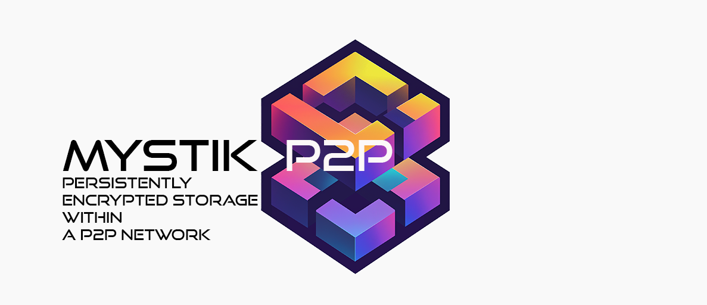

# MYSTIK>P2P

> **This is a historical document.** It is the README of MYSTIK>p2p (Nov 2024 to Mar 2025),
> the project ØMYSTIK grew out of, kept because it is the original description of the
> MID/CID storage model that Mesh A still uses. It describes that earlier system, not
> ØMYSTIK as it stands today. For the current architecture, read
> [docs/ARCHITECTURE.md](docs/ARCHITECTURE.md).

A persistent storage peer to peer network based on [rust-libp2P](https://github.com/libp2p).



## Mechanism
A user from a local node encrypted a file.<br>

This encrypted file obtain a **CID** and is stored into local node.
At the same time the user add metadata to enable future queries from remote nodes
Metadata are name, filetype, secret code.<br>

Each of them is actually a leaf in a merkle tree where the root is actually the **MID**.<br>

In the local node then, a sparse merkle tree stores the MID / CID pair
Then, the MID is published to the network (as a DHT table: MID / Node’s address pair).

When a user in a remote node wants a file, it has to obtain somehow the exact name, filetype, secret code in order to let its local node computing the MID and looking for into the current DHT the MID / Node’s address pair that match the computed MID.<br>
Then the Node which has received the matching request, return the corresponding CID file.


#### Encryption:<br>
The file is encrypted thanks to XChaCha20Poly1305 which creates file’s chunk ciphertext.<br>
The final ciphertext has the CID as name thanks to a key and nonce.

#### File’s Metadata:<br>
When storing a file, user (human, AI agent) has to provide « clear text » metadata.
Each metadata is hashed and used as a leaf into a merkle tree where the roots is the MID.
As a consequence, a user (human, AI agent) which would like to call a given file, he/she/it needs to know the related « clear text » metadata.<br>
The local node will reconstruct the MID and look for into the network the nodes providers.

#### Sending and Receiving file:<br>
After an (encrypted) file has been requested, the file’s provider sends the file with a Blake hashing and the file’s requester receives the file with a Blake hashing.

#### Decryption:<br>
To decrypt a file, one needs the key and nonce used at encryption.

```
// About rust-libp2P
// Copyright 2021 Protocol Labs.
//
// Permission is hereby granted, free of charge, to any person obtaining a
// copy of this software and associated documentation files (the "Software"),
// to deal in the Software without restriction, including without limitation
// the rights to use, copy, modify, merge, publish, distribute, sublicense,
// and/or sell copies of the Software, and to permit persons to whom the
// Software is furnished to do so, subject to the following conditions:
//
// The above copyright notice and this permission notice shall be included in
// all copies or substantial portions of the Software.
//
// THE SOFTWARE IS PROVIDED "AS IS", WITHOUT WARRANTY OF ANY KIND, EXPRESS
// OR IMPLIED, INCLUDING BUT NOT LIMITED TO THE WARRANTIES OF MERCHANTABILITY,
// FITNESS FOR A PARTICULAR PURPOSE AND NONINFRINGEMENT. IN NO EVENT SHALL THE
// AUTHORS OR COPYRIGHT HOLDERS BE LIABLE FOR ANY CLAIM, DAMAGES OR OTHER
// LIABILITY, WHETHER IN AN ACTION OF CONTRACT, TORT OR OTHERWISE, ARISING
// FROM, OUT OF OR IN CONNECTION WITH THE SOFTWARE OR THE USE OR OTHER
// DEALINGS IN THE SOFTWARE.
```