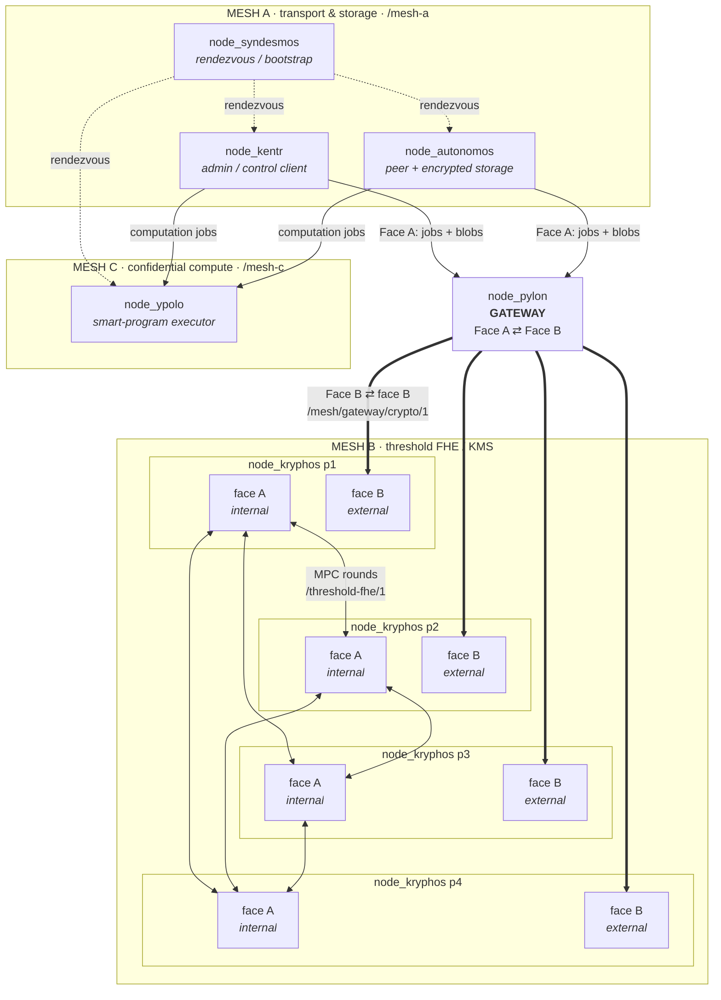
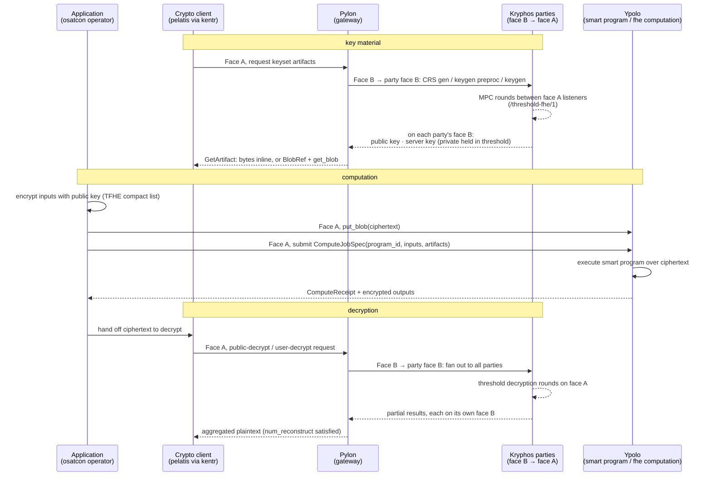
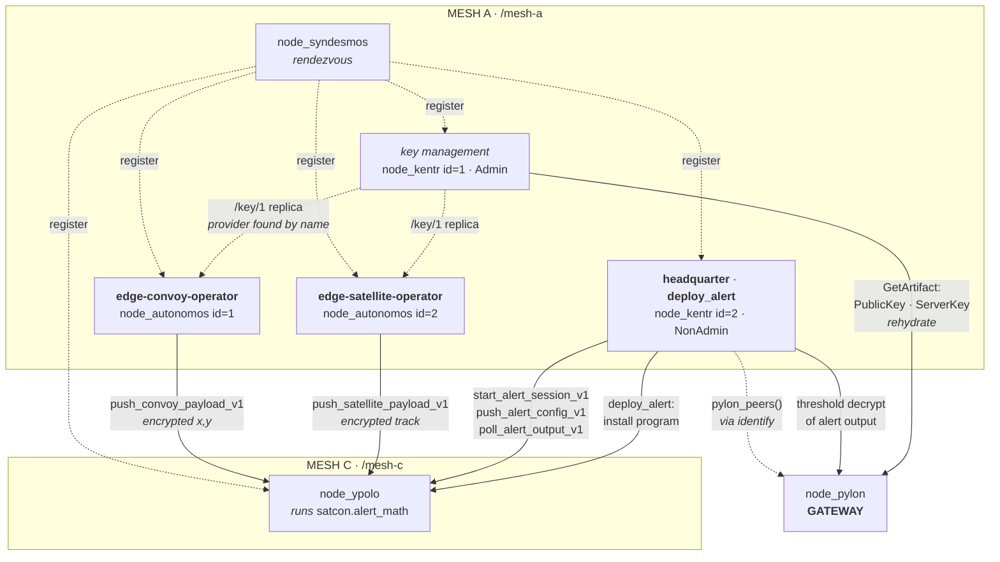

# ØMYSTIK Architecture

This document describes how ØMYSTIK is put together: the several meshes, the gateway,
the protocols they speak, and the paths data takes through the system.

For what each crate contains, see [CRATES.md](CRATES.md). To run it, see
[GETTING_STARTED.md](GETTING_STARTED.md).

---

## 1. The principle

In ØMYSTIK nodes find each other through rendezvous points and several meshes form a mesh over
whatever transport is available (tested so far over Wi-Fi and the internet).


On-demand, files stored on a certain type of nodes are encrypted before they touch
the disk and are addressed by a content identifier; the files' metadata are hashed
into a Merkle root as metadata identifier.<br>
So a user who requests a file, needs to known the cleartext files' metadata so that local
the mesh network propose the current owning peer(s) without anyone knowing what the content is.<br>

Computation over data happens under fully homomorphic encryption, with the keys never assembled in one place. They are
held in threshold by a separate set of MPC parties. The result is a network that carries
data it cannot read, for peers it does not trust.

## 2. Three meshes and a gateway

ØMYSTIK is not one flat network. It is three meshes with distinct trust properties,
bridged deliberately rather than merged.



### Mesh A: transport and encrypted storage

Namespace `/mesh-a`. This is the ØMYSTIK descendant of MYSTIK>p2p: peer discovery,
persistent encrypted storage, and content routing.

Its swarm behaviour (`libp2p_common::komvos::CompositeBehaviour`) composes relay, ping,
identify, Kademlia DHT, rendezvous (client and server), libp2p streams for bulk transfer,
and a request-response protocol for job control.

| Node | Binary | Role |
|---|---|---|
| `node_syndesmos` | `node_syndesmos` | Rendezvous and bootstrap. Fixed address, well-known peer ID. Other nodes register here to be discovered. |
| `node_autonomos` | `node_autonomos` | The sensor node. Gathers and encrypts data, can store encrypted content to serve it to peers thanks to published Merkle roots to the DHT. |
| `node_kentr` | `kentr` | Control plane. Key-artifact orchestration, key rehydration, and mesh commands; carries `Admin` / `NonAdmin` roles. |

### Mesh B: threshold FHE and key management

A set of MPC parties running Zama's KMS, transported over libp2p rather than gRPC. This
mesh holds the FHE key material in threshold form and performs key generation, CRS
generation, and decryption as multi-party protocols.

`node_kryphos` (binary `node_fhe`) is one party. A cluster is typically 4 parties with
a configured majority and reconstruction threshold.
A cluster of parties follows the $3t + 1$, where $t$ is the maximal number of compromised party.

**Each party has two faces, on two separate listeners.** This is the structural point about
Mesh B, and it is what keeps the key material enclosed:

| | Face A, internal | Face B, external |
|---|---|---|
| **Talks to** | the other Kryphos parties | the Pylon gateway, and nothing else |
| **Carries** | MPC rounds: keygen, CRS gen, threshold decryption | crypto-operation requests and partial results |
| **Protocol** | `mpc_protocol` = `/threshold-fhe/1` | `gateway_protocol` = `/mesh/gateway/crypto/1` |
| **Listener** | `listen_address` (e.g. `udp/50100`) | `gateway_listen_addr` (e.g. `udp/8100`) |
| **Manager** | `KryphosManager` (`node_kryphos::node_kryphos`) | `KryphosPylonManager` (`node_kryphos::pylon`) |
| **libp2p facade** | `libp2p_common::kryphos` | `libp2p_common::kryphos_pylon` |

Both facades are thin wrappers over the same `libp2p_common::kryphos_dual::DualBehaviour`,
which registers both request-response protocols; each manager drives the one belonging to
its role.

So the crypto path is: **Pylon's Face B connects to each party's face B.** The MPC rounds
that actually do the threshold work happen entirely between the parties' face A listeners.
Pylon has no part in them and never sees a round message. It issues a request on the
external faces, the parties confer among themselves internally, and each returns its partial
result on its own face B.

> A party's "face A" is internal to Mesh B and unrelated to Pylon's Face A, which is the
> Mesh-A-facing jobs and blobs protocol. The names rhyme; the protocols do not.

**This is where ØMYSTIK's principal modification to upstream Zama code lives.** Zama's KMS
expects gRPC between parties; ØMYSTIK substitutes a libp2p transport (`kryphos_dual`,
`node_kryphos::pylon`) so parties can be MPC participants over the same mesh fabric as
everything else, which is what makes threshold FHE workable on links that come and go.

### Mesh C: confidential compute

Namespace `/mesh-c`. Executors that run ***smart programs*** over encrypted inputs.

`node_ypolo` (binary `ypolo`) receives a `ComputeJobSpec`, resolves its inputs and
artifacts, runs the named program, and returns a signed receipt. It discovers peers
through Mesh A's rendezvous but registers under its own namespace, so compute capacity is
addressable separately from storage.

Mesh A nodes reach an executor **by direct dial from configuration** for simplicity, not through
discovery: a caller reads `peer_id` and `listen_address` for the target from
`mesh_c_cluster*.toml` and dials it. The Autonomos nodes push encrypted session inputs; the
Kentr nodes open the session, push its configuration, and poll for output. Both are
ordinary `komvos` clients, and the compute vocabulary rides the same Mesh A swarm.

`compute-client` also offers `discover_available_ypolo`, which registers at a rendezvous and
probes candidates with `GetCapabilities`. It is available but currently unused: everything
in the tree dials from config instead.

Two executors exist: `executor_tfhe` (in-process TFHE evaluation, needs a server key) and
`executor_external_process` (spawns a separate binary implementing the program, which is how
`smart-program-alert` is deployed).

### The Pylon gateway

`node_pylon` is the bridge, and it is deliberately the only one. It has two faces:

- **Face A** looks at Mesh A: job control and blob transfer with ordinary nodes.
- **Face B** looks at Mesh B: crypto operations against the MPC parties, fanned out to all
  parties and aggregated according to `num_majority` / `num_reconstruct`.

Keeping the crypto mesh reachable only through a gateway means Mesh A peers never hold a
direct channel to an MPC party. A hostile storage node cannot address the key material.

To avoid critical bottleneck, a dedicated mechanism to manage several Pylon nodes is under development.

### How nodes find each other

Five distinct mechanisms, each used for a different kind of target. Which one applies
depends on what is being looked for, and they are easy to confuse.

**1 · Rendezvous registration: how a node joins.**
Every node registers with a Syndesmos node under a namespace: `/mesh-a` for Autonomos and
Kentr, `/mesh-c` for Ypolo.

```rust
manager.register_rendezvous(syndesmos_addr, syndesmos_peer, namespace)
```

The rendezvous point itself is **not discovered**. Its `peer_id` and address are pinned in
the cluster TOML (`syndesmos_peer` / `syndesmos_addr`, `syndesmos_peer_id_1` /
`syndesmos_address`). This is the trust anchor: a node believes the mesh it is told to
believe. Registration makes a node visible to others and connects it to the swarm; it is not
a lookup.

**2 · Identify: how the Pylon gateway is found.**
Nobody configures the gateway's address. `KomvosManager` watches
`komvos::Event::PeerIdentified` and records any peer whose libp2p identify
`protocol_version` is `/pylon-face-a/0.1.0`:

```rust
fn is_pylon_face_a_protocol(protocol_version: &str) -> bool {
    protocol_version == "/pylon-face-a/0.1.0"
}
```

Those peers accumulate in `pylon_face_a_peers`, and `manager.pylon_peers()` returns them.
A Kentr node that finds the list empty cannot perform a threshold decryption yet. It must
wait for a Pylon to appear. So the gateway is discovered *by protocol version*, structurally
rather than by name.

**3 · Kademlia DHT provider records: how stored content is located.**
The only mechanism that is a genuine lookup by name. A node advertises what it holds with
`spread_into_network` (a `start_providing` call) and a consumer resolves it with
`get_providers`; both map onto `kademlia.start_providing` / `kademlia.get_providers` over
the name's bytes.

This is how **content** is found: providers (the value) are advertised under the file's MID (the key), and a peer
that has recomputed the MID from the metadata resolves the providers holding it.
<br>
Then, file's owner needs to find the CID (Content ID) into a local merkle tree. [See §4](#4-how-file-storage-and-exchange-works).

The DHT holds provider records. No file is stored in it.

**4 · Face A `GetArtifact`: how FHE key material enters Mesh A.**
Key artifacts are generated by the MPC then each party owns the data.<br>
Currently, they are held by the Pylon, and pulled from it by Mesh A's nodes over Face A:
- Kentr: all type of keys,
- Autonomos: PublicKey,
- Ypolo: ServerKey.

`node_kentr::mesh_cmd::fetch_keyset_artifacts_from_pylon` requests each kind explicitly:

```rust
net_client.jobs_request(
    pylon_peer,
    FaceARequest::GetArtifact { id: key_id, kind },   // PublicKey
).await                                              // PublicKeyMetadata
                                                     // ServerKey
```

The response carries the bytes as `Payload::Inline`, or as a `Payload::BlobRef` then fetched
with `get_blob` over the Face A blob protocol, since a server key is far too large to inline.
This is request-response against one already-known gateway: no lookup, no provider record,
no Kademlia.

Distribution therefore happens in **two stages**, and conflating them is the easy mistake:

| | Stage 1, acquisition | Stage 2, replication |
|---|---|---|
| **From** | the Pylon (holding Mesh B's keys) | another Mesh A peer that already has a copy |
| **By** | a Kentr node, `--rehydrate-key` | any node calling `ask_key` |
| **Mechanism** | Face A `GetArtifact` (+ `get_blob`) | `/key/1` stream |
| **Role of the DHT** | none | locating *which peer* holds a copy |

Stage 2 is what `KeyServices::get_key` performs: `get_providers(key_type)` resolves peers
that advertised the key-type **name** (`PublicKey`, `PublicKeyMetadata`, `ServerKey`), then
it dials one and pulls the bytes over `/key/1`. A node becomes such a provider only after
holding a copy. `key_rehydration` saves the artifact with `save_key_at_path` and *then*
calls `spread_into_network(key_type.to_string())`. Each node that later acquires a copy
advertises itself in turn, so copies fan out across Mesh A while every original still comes
from the gateway.

`ask_key` wraps stage 2 in a retry loop that first wipes the local key directory and does not
return until a key arrives and validates. Key acquisition is treated as mandatory: a node
that cannot obtain the public key cannot encrypt, so it waits rather than continuing.

**5 · Direct dial from configuration: how executors and MPC parties are reached.**<br>
Mesh C executors and Mesh B parties are addressed from config, not looked up. A caller
takes the target's `peer_id` and `listen_address` straight from `mesh_c_cluster*.toml` and
dials it; Kryphos party addresses come from `mpc_cluster*.toml`, held only by Pylon. This is
the least dynamic mechanism and the one most in tension with the project's resilience goals
A rendezvous-based path exists (`discover_available_ypolo`) but nothing in the tree uses
it yet.

| Target | Mechanism | Source of truth |
|---|---|---|
| Syndesmos (rendezvous) | pinned | cluster TOML |
| Peers in a namespace | rendezvous registration | Syndesmos |
| Pylon gateway | libp2p identify, protocol-version match | `/pylon-face-a/0.1.0` |
| Content (by MID) | Kademlia provider records, then `/file-exchange/1` | DHT |
| FHE key artifacts, original | Face A `GetArtifact` / `get_blob` | the Pylon |
| FHE key artifacts, replica | Kademlia name index, then `/key/1` | a peer that already holds one |
| Ypolo executor | direct dial | `mesh_c_cluster*.toml` |
| Kryphos parties | direct dial (Pylon only) | `mpc_cluster*.toml` |

## 3. Protocol identifiers

| Constant | Value | Between |
|---|---|---|
| `FILE_EX_PROTOCOL` | `/file-exchange/1` | Mesh A peers, bulk file transfer over streams |
| `KEY_RAW_PROTOCOL` | `/key/1` | Mesh A peers, public-key / server-key artifact transfer |
| `NAMESPACE_MESH_A` | `/mesh-a` | Mesh A rendezvous namespace |
| `FACE_A_JOBS_PROTOCOL` | `/mesh/gateway/jobs/1` | Mesh A node → Pylon *and* Mesh A node → Ypolo |
| `FACE_A_BLOBS_PROTOCOL` | `/mesh/gateway/blob/1` | Blob upload and fetch, against Pylon or Ypolo |
| `FACE_B_CRYPTO_PROTOCOL` | `/mesh/gateway/crypto/1` | Pylon's Face B → each Kryphos party's face B |
| `mpc_protocol` | `/threshold-fhe/1` | Kryphos face A ⇄ Kryphos face A, MPC rounds internal to Mesh B |
| n/a | `/mesh-c` | Mesh C rendezvous namespace |

Face A is served by both Pylon and Ypolo. The same request-response vocabulary asks a
gateway for a crypto operation and an executor for a computation; where discovery is used,
a caller tells them apart with `GetCapabilities` and the returned `NodeType`. What differs
is how each is reached: the gateway by identify, the executor by direct dial.

Transport throughout is QUIC (`/udp/<port>/quic-v1`), and only QUIC. Every swarm is built
`.with_tokio().with_quic()`, no TCP leg is configured, and peer authentication comes from
QUIC's TLS 1.3 with the node's Ed25519 identity bound in through the libp2p certificate
extension. Noise plays no part, despite being the libp2p default most readers expect. See
[CRYPTOGRAPHY.md §2.1](CRYPTOGRAPHY.md#21-own-crates).

## 4. How file storage and exchange works

The storage and exchange model is inherited from MYSTIK>p2p, and its two-level Merkle structure is the
part worth understanding. The original description of that model, written for the earlier
project, is kept at [README_mystik-p2p.md](../README_mystik-p2p.md).

```mermaid
graph LR
    F["plaintext file"] -->|XChaCha20Poly1305<br/>streaming, 2 MiB chunks| C["ciphertext<br/>named by <b>CID</b>"]
    F -.->|user supplies| M["metadata:<br/>file_name · file_type · secret"]
    M -->|hash each as a leaf<br/><i>rs_merkle</i>| MID["<b>MID</b><br/>Merkle root"]
    MID -->|key| SMT["sparse Merkle tree<br/><i>monotree + blake3</i>"]
    C -->|leaf| SMT
    MID -->|published| DHT[("Kademlia DHT<br/>MID → provider(s)")]
```



**Storing file.**<br>
`persistency_utils::store_file` generates a fresh 32-byte key and 19-byte
nonce, encrypts the file in 2 MiB chunks with XChaCha20Poly1305, and names the ciphertext
by its content identifier (CID). <br>
Separately, the caller's three metadata fields
(`file_name`, `file_type`, `secret`) become leaves of a classic Merkle tree whose root is
the metadata identifier (MID). <br>
A sparse Merkle tree then records the MID → CID pair, and
the MID is published to the Kademlia DHT as a provider record.

The function returns the key, the nonce, the MID, and the CID.
**The mesh keeps no copy of the key or nonce.**

**Retrieving file.**<br>
A user who knows all three metadata values asks a local or remote peer, which recomputes the
MID, queries the DHT for providers, and requests the file over `/file-exchange/1`.<br>

**Transfers** are Blake3-hashed on both ends.<br>

**Decrypting file.**<br>
requires the key and nonce, which must have reached the requester by some other channel.

The design consequence: **knowledge of the metadata is the capability to locate content**,
in those two steps. The `secret` field is the access control. See
[SECURITY.md](../SECURITY.md#content-and-metadata) on why low-entropy secrets defeat this.

## 5. How a confidential computation works

The OSATCON demo is a perfect fit to explain the mechanism.

Encrypting data, computing over it, and decrypting the result each cross a different
trust boundary.



Two distinct callers appear here.
- The **application** (an OSATCON operator embedding
`smart-program-alert`) owns the compute path to Ypolo.
- The **crypto client**
(`plegma-fhe-pelatis`, driven through `node_kentr`) owns the key and decryption path to
Pylon.
<br>
In `headquarter` both live in one process, which is why the split is easy to miss.

Three properties fall out of this shape:

1. **Ypolo never holds a decryption key.** It computes on ciphertext with a server key
   (evaluation key) and cannot read its own inputs or outputs.
2. **No single Kryphos party can decrypt.** Reconstruction needs `num_reconstruct`
   parties to cooperate.
3. **Pylon aggregates but does not decrypt.** It collects partials from the parties'
   external faces and applies the threshold rule; it holds no share of its own, and the
   rounds that combine the shares happen on the internal faces where it has no presence.

A *smart program* is a unit of computation with a stable identity (`ProgramId` +
`ProgramVersion`), a manifest declaring its slots and artifacts, and a typed ABI.<br>
The `SmartProgram` trait in `compute-program` is what a domain crate implements; `compute-abi`
defines the wire types both sides agree on. Programs can be session-oriented, accepting
live inputs over time via `try_build_session_inputs` and running when they have enough,
which is how the OSATCON alert program consumes a stream of positions.

## 6. Reference application: OSATCON

`osatcon/` is a working end-to-end demonstration, and the clearest illustration of what
the mesh is for.<br>
The scenario: a convoy moving along a ground corridor, satellites
overhead, and a question: *is the convoy about to be observed?*

Answering it normally means someone pools the convoy's route with the satellite ephemeris.
Under ØMYSTIK, nobody does. Convoy positions and satellite tracks are encrypted by their
own operators; the exposure computation runs homomorphically on Ypolo; only the alert is
decrypted (here by headquarter).

| Crate | Role |
|---|---|
| `ofield-core` | Domain maths: geodesy, projection, convoy interpolation, satellite tracks, alert geometry, and a versioned scenario format (`OsatconScenarioV1`) so every participant computes against identical parameters |
| `smart-program-alert` | The FHE smart program `satcon.alert_math` v0.1.0, computing exposure over `FheUint64`/`FheBool`, plus `deploy_alert`, which installs it on an Ypolo executor |
| `edge-convoy-operator` | Field terminal for the convoy; contributes encrypted positions |
| `edge-satellite-operator` | Field terminal for satellite tracking; contributes encrypted tracks |
| `headquarter` | Command view; requests decryption of alerts through Kentr |

### Deployment topology

Each OSATCON binary *is* a Mesh A node: it builds a `KomvosManager` from a node
configuration and takes that node's identity. Two run as Autonomos, two as Kentr. Mesh B is
omitted here; it sits behind the Pylon exactly as in [§2](#2-three-meshes-and-a-gateway).



The sequence in practice:

1. **Admin Kentr (id 1)** generates or rehydrates the keyset by pulling it from the Pylon
   with Face A `GetArtifact`, saves it locally, and only then advertises itself as a
   provider of those key names, after which Mesh A peers can replicate copies from it over
   `/key/1`.
2. **`deploy_alert`**, running as Kentr id 2, installs `satcon.alert_math` on the executor.
   Its `--runner-command` is the path to the `smart-program-alert` binary *as seen from the
   Ypolo host*, because the program runs as an external process there.
3. **Headquarter** registers, discovers the Pylon by identify, builds a `ThresholdFheClient`
   over the discovered gateways, dials Ypolo, opens the session, and pushes the encrypted
   alert-zone configuration (the radius from the scenario).
4. **The two edge operators** each fetch the public key with `ask_key`, dial Ypolo, and then
   loop: sample position or track, project it to integers, encrypt each coordinate as
   `FHE_UINT64`, and push it as a session input.
5. **Ypolo** evaluates the alert program over the accumulated ciphertexts as inputs arrive.
6. **Headquarter** polls the encrypted output and decrypts it through the threshold, the
   only point in the whole flow where plaintext appears.

Everything binding the participants together is the **session id**, derived from a shared
`--session-code` (`session_id_from_code`). All four must be started with the same code, and
all read the same `OsatconScenarioV1` so their projections and tick alignment agree.
Otherwise they encrypt coordinates that are not comparable.

This is the builds dispatched:
- 2 * Raspberry Pi Zero 2 W: syndesmos, pylon (--target armv7-unknown-linux-gnueabihf),
- 1 * Raspberry Pi 5: edge-convoy-operator (--target aarch64-unknown-linux-gnu),
- 1 * 2011 MacBook running Kali Linux: edge-satellite-operator (--target x86_64-unknown-linux-gnu),
- 1 * 2013 MacBook Pro: ypolo / smart-program-alert (--target x86_64-apple-darwin)
- 1 * 2018 MacBook Pro: kentr/headquarter (--target x86_64-unknown-linux-gnu)
- 4 * Computation Unit (Google Cloud Platorm): kryphos (--target x86_64-unknown-linux-gnu),

## 7. Design decisions worth knowing

**Several meshes rather than one** Trust separation and different behaviors for different models.

**Why vendor Zama's KMS instead of depending on it?** The libp2p transport substitution is
invasive, since it replaces the inter-party communication layer. See
[LICENSING.md §2](../LICENSING.md#2-zama-components-commercial-use-requires-an-agreement)
for the obligations vendoring creates, and note that upstream fixes must be ported by hand.


**QUIC only**<br>
Faster recovery from path changes than TCP, chosen with roaming nodes in mind: a terminal
that changes address mid-session should keep the session rather than rebuild it. This
release has only been run over Wi-Fi and wired internet, so that is the reason for the
choice and not a result measured on this system.

---

*Security posture: [SECURITY.md](../SECURITY.md) · Responsible use:
[DUAL_USE.md](../DUAL_USE.md) · Crate reference: [CRATES.md](CRATES.md)*
