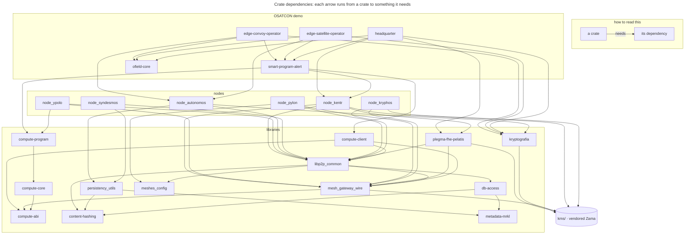

# Crate Reference

The workspace has 24 members plus the vendored `kms/` tree and the root `mesh` crate. This
document groups them by layer and states what each one owns.

For how they fit together, read [ARCHITECTURE.md](ARCHITECTURE.md) first.

> **Not crates:** `nodeA/` … `nodeN/` are per-node *runtime data trees*, not Rust packages.
> See [NODE_LAYOUT.md](NODE_LAYOUT.md).

---

## Dependency shape

To provide a global understanding, this dependency shape shows the whole OSATCON demo.<br>



---

## Storage and cryptography

### `content-hashing`
> *Encryption content, Hashing checking*

Content encryption and content addressing. `newkey()` generates a 32-byte key and 19-byte
nonce; `encrypt_file` / `decrypt_file` stream files through **XChaCha20Poly1305** in 2 MiB
chunks (`EncryptorBE32` / `DecryptorBE32`), producing a ciphertext named by its **CID**.
The `blakecheck` module provides Blake3 verification for transfers.

Storage locations come from the environment (`STORAGE_DIR`, `KEYS_DIR`) with defaults
under `./data/`.

**Owns the invariant that plaintext never reaches disk.**

### `metadata-mrkl`
> *Merkle Tree applied to metadata*

Two Merkle layers over file metadata:

1. **Classic tree** (`rs_merkle`, SHA-256) hashes `file_name`, `file_type`, `secret` as
   leaves; the root is the **MID** (metadata identification). `prove_leaf_persistent` proves a leaf's membership.
2. **Sparse tree** (`monotree` + Blake3 + `sled`): `MonoMetaTree` maps MID → CID
   persistently (content identification).

Reads `STORAGE_MERKLE` and `STORAGE_MIDCID` from the environment. `store_rsmerkle`
(private) handles persistence of the classic trees.

### `persistency_utils`

Orchestration over the two above. `store_file(file_name, file_type, secret, file_path)`
runs the whole store path (key generation, encryption, MID computation, membership proof,
sparse-tree insertion) and returns `(key, nonce, MID, CID)`. Companion retrieval and
removal paths mirror it.

**This is the crate to read first** if you want to understand the storage model, because it
is where the sequence is visible in one place. For the model stated in prose rather than
code, see [README_mystik-p2p.md](../README_mystik-p2p.md).

### `db-access`

Reconstructs MID/CID pairs by walking the filesystem rather than consulting an index. CIDs
are `.bin` files under the content directory, MIDs are subdirectory names under
`metadata/metamerkle`. Recovery and inspection utility; the authoritative mapping lives in
the sparse Merkle tree.<br>
Useful when a node starts with existing stored content: that inventory has to be fed back
into the network before peers can find it again.

### `kryptografia`

The FHE encryption boundary. `FheEncryptor` wraps a TFHE `CompactPublicKey` and builds
`CompactCiphertextList`s using TFHE safe serialization (`tfhe.safe_serialize.CompactCiphertextList.v1`).<br>
Bridges ØMYSTIK types to KMS ciphertext types (`TypedCiphertext`, `TypedPlaintext`, `CiphertextFormat`)
and carries the FHE type constants, including `FHE_INT64 = 10064`, a local extension
because the KMS `FheType` enum has no signed types.

---

## Networking and wire protocol

### `libp2p_common`
> *libp2p for FHE p2p mesh*

Every swarm behaviour in the project. The largest and most central library, though not the
lowest: it depends on `mesh_gateway_wire`, `meshes_config`, `content-hashing` and
`db-access`, so the wire types and storage primitives sit beneath it.

| Module | Lines | Contents |
|---|---|---|
| `komvos` | 1733 | **Mesh A.** `CompositeBehaviour`: relay, ping, identify, Kademlia, rendezvous (client + server), streams, request-response. The `Client` / `EventLoop` / `Event` triple: `start_listening`, `advertise`, `register`, `dial`, `start_providing`, `get_providers`, `request_file`, `request_key`, `get_blob`, `put_blob`, `jobs_request`, `ack_pinned` |
| `kryphos_dual` | 841 | **Mesh B.** `DualBehaviour`: two request-response protocols: `ThresholdCodec` for MPC rounds and `ComputeEncCodec` for the gateway-facing face. `parties_mesh_ready` gates on party connectivity |
| `kryphos` | 62 | Thin facade over `kryphos_dual` driving a party's **internal face A** (MPC) |
| `kryphos_pylon` | 78 | Thin facade over `kryphos_dual` driving a party's **external face B** (kryphos' gateway) |
| `manager` | 338 | `KomvosManager`, node lifecycle: construction, inbound request task, rendezvous registration, MID/CID registration, Pylon peer lookup. Vends `KeyServices` and `FileServices` |
| `node_services` | 302 | `KeyServices` (`get_key`, `ask_key`) and `FileServices` (`init_publishing_mid_to_dht`, `get_file`, `access_the_db`), plus `spread_into_network` |
| `node_primary` | 241 | `NodeType`, `NodeRole`, `KeyType`; protocol constants; per-node-type config structs deserialized from TOML |
| `jobscodec` | 74 | `JobsCodec` request-response codec and length-prefixed blob framing |
| `key_ops` | 206 | Key artifact filesystem operations: validation, public-key-id derivation, distribution to parties, local key loading |

### `mesh_gateway_wire`

The Face A / Face B vocabulary. Deliberately small and dependency-light so both sides of
every boundary can agree on it.

- **Face A**: `FaceARequest` / `FaceAResponse` / `FaceABlobHeader`: job submission, blob
  transfer, capability query. `CapabilityInfo` and `NodeType` are how a client tells a
  gateway from an executor.
- **Face B**: `FaceBRequest` / `FaceBResponse` / `CryptoOp` / `CryptoJobState`:
  crypto operations, with `PartyProtoResult` and `AggregatedJobResult` for threshold
  aggregation.
- **Jobs**: `JobMetadata`, `JobType`, `JobState`, `Payload`, `JobResultPayload`;
  `JobStore` / `JobRecord` persist job state across restarts.
- **Artifacts**: `ArtifactManifest`, `ArtifactEntry`, `SignedArtifact`, `SignedManifest`,
  `ArtifactSignature`, `ArtifactAlias`, `VersionSelector`, and `verify_signed_artifact`.
- `blake3_blob_id` derives a `BlobId` from content.

Serialization is `serde` + `bc2wrap` (Zama's bincode wrapper); libp2p carries opaque
`Vec<u8>` which each side decodes into these enums.

### `meshes_config`
> *config for FHE p2p mesh*

Cluster configuration. Holds the Face A / Face B / jobs / blobs protocol constants, plus
`GatewayConfig` and the Mesh A config parsers. Ships the TOML cluster definitions:

| File pattern | Describes |
|---|---|
| `mesh_a_cluster*.toml` | Syndesmos + Autonomos nodes, Mesh A |
| `mesh_c_cluster*.toml` | Ypolo executors, Mesh C |
| `mpc_cluster*.toml` | Kryphos MPC parties, Mesh B |
| `gateway_cluster*.toml` | Pylon gateways, Face A + Face B |
| `kentr_cluster*.toml` | Kentr control nodes |
| `default_N.toml` | Per-party KMS core service configuration which is from KMS |

Each comes in bare (production), `_local`, and `_test` variants; `mpc_cluster_ext.toml` and
`mpc_cluster_gcp.toml` target external and Google Cloud deployments.

---

## Compute framework

A four-crate layering that keeps wire types, execution, program definition, and client
concerns separate.

### `compute-abi`

Wire types only, with no logic and no networking. `ComputeJobSpec`, `ComputeReceipt`,
`ProgramManifest`, `ProgramSlot`, `ProgramArtifactRequirement`, `ArtifactBinding`,
`InputPayload` (`Inline` or `BlobRef`), `InstalledProgramRecord`,
`ProgramPackageManifest`. Identity is `ProgramId` + `ProgramVersion`.

`ProgramRuntimeKind` names four execution strategies: `NativeBuiltin`, `WasmModule`,
`ComputeGraphV1`, `ExternalProcessV1`. The `ComputeGraphV1*` types define a declarative
operation graph (ops, input/output bindings, typed payload fields); the
`ExternalProcess*V1` types define the protocol for a program running as a separate process.

### `compute-core`

The executor contract, and almost nothing else:

```rust
#[async_trait]
pub trait ComputeExecutor: Send + Sync {
    async fn execute(&self, ctx: ComputeContext, exe_inputs: ExecutorInputs)
        -> Result<ComputeOutput>;
}
```

With `ExecutorInputs` (spec, inputs, session inputs, artifacts), `ComputeSessionInput`
(kind, bytes, observed timestamp, sequence) and `ComputeOutput`.

### `compute-program`

The program contract. A domain crate implements `SmartProgram`, owning its manifest, typed
ABI, and execution kernel:

```rust
pub trait SmartProgram: Send + Sync + 'static {
    fn descriptor(&self) -> ProgramDescriptor;
    fn manifest(&self) -> ProgramManifest;
    fn execute(&self, exec_inputs: ExecutorInputs) -> Result<ComputeOutput>;

    // Session programs override this; Ypolo calls it as live inputs arrive and
    // runs the program once it returns Some.
    fn try_build_session_inputs(&self, _: &HashMap<String, Vec<u8>>)
        -> Result<Option<Vec<Vec<u8>>>> { Ok(None) }
}
```

### `compute-client`

Client-side SDK for submitting work:

| Module | Provides |
|---|---|
| `discovery` | `discover_available_ypolo`, which registers at rendezvous, probes peers with `GetCapabilities`, returns an executor |
| `upload` | `put_blob`, `register_artifact` |
| `submit` | `build_compute_job_spec`, `submit_compute_job`, `upload_input_blobs`, `upload_and_register_artifacts`, `push_program_session_input` |
| `poll` | `wait_for_job_result`, `fetch_receipt_bytes` |
| `deploy` | Program installation onto an executor |

---

## Nodes

### `node_syndesmos`: Mesh A rendezvous
**Binary:** `node_syndesmos` · **Config:** `mesh_a_cluster*.toml` → `[[syndesmos]]`

Bootstrap and rendezvous point. Fixed address and well-known peer ID; other nodes register
here to become discoverable. Binary-only, with no library. Also exposes an interactive
`store` / `call` / `get` prompt, so a rendezvous node doubles as a storage peer.

Deployed to Raspberry Pi Zero 2 W in the reference setup on OSATCON demo.

### `node_autonomos`: Mesh A sensor node
**Binary:** `node_autonomos` · **Config:** `mesh_a_cluster*.toml` → `[[autonomos]]`

The sensor node: gathers and encrypts data, and can store encrypted content to serve to
peers via the Merkle roots it publishes to the DHT. Its `encryption` module wraps the
store/retrieve paths; the crate re-exports `kryptografia` so the node can also act as an FHE
client, which is what the OSATCON edge operators build on. It pulls the `PublicKey`
artifact only, enough to encrypt but not to evaluate.

### `node_kentr`: Mesh A control plane
**Binary:** `kentr` · **Config:** `kentr_cluster*.toml`

Administrative and key-orchestration node, carrying `Admin` or `NonAdmin` role. It builds
its own `KomvosManager` from `libp2p_common` and leans on `plegma-fhe-pelatis` for the FHE
key and decryption lifecycle. It pulls **all three** key kinds, where an Autonomos takes
only the `PublicKey`.

| Module | Role |
|---|---|
| `mesh_cmd` | Mesh commands, including `fetch_keyset_artifacts_from_pylon` |
| `key_artifacts` | Keyset artifact handling |
| `key_rehydration` | Restoring key material into a node (`--rehydrate-key`) |

Wraps Zama's `kms_core_client`, so `kentr` also drives KMS operations:
`preproc-key-gen`, `key-gen`, `key-gen-fresh`, `user-decrypt`, `crs-gen`.

### `node_kryphos`: Mesh B MPC party
**Binary:** `node_fhe` · **Config:** `mpc_cluster*.toml` → `[[node]]`

**The most significant modification to upstream Zama code.** A KMS threshold party whose
inter-party transport is libp2p instead of gRPC. Builds `RealCentralizedKms` /
`new_real_threshold_kms` with `P2pInputs`, handles attestation via
`SecurityModuleProxy`, and manages vaults and keychains (local, AWS KMS, S3).

Each party runs **two managers on two separate listeners**. See
[ARCHITECTURE.md §2](ARCHITECTURE.md#mesh-b--threshold-fhe-and-key-management):

| Module | Manager | Face | Listener | Protocol |
|---|---|---|---|---|
| `node_kryphos` | `KryphosManager` | face A, internal, MPC rounds between parties | `listen_address` | `/threshold-fhe/1` |
| `pylon` | `KryphosPylonManager` | face B, external, serves the gateway only | `gateway_listen_addr` | `/mesh/gateway/crypto/1` |
| `kryphos_config` | n/a | party configuration | | |

Pylon's Face B connects to each party's face B; the MPC rounds happen entirely on the face
A listeners, where the gateway has no presence.

Requires the `p2p` feature. Documented runs also pass `insecure`. See
[SECURITY.md](../SECURITY.md#insecure-is-a-default-feature).

### `node_pylon`: the gateway
**Binary:** `node_pylon` · **Config:** `gateway_cluster*.toml` + `mpc_cluster*.toml`

`GatewayManager` runs both faces and the job store.

| Module | Role |
|---|---|
| `face_a_jobs` | Mesh A job control (server side) |
| `face_a_blobs`, `face_a_blobs_client` | Blob transfer, both directions |
| `face_b` | `FaceBManager`, client to the Kryphos parties (Kryphos' face B only) |
| `runtime` | `GatewayRuntime`, job execution and result aggregation |
| `kryphos_config_copy` | Local copy of party config parsing |

Tracks discovered Mesh A peers (excluding rendezvous nodes) and applies the
`num_majority` / `num_reconstruct` threshold rules when aggregating party responses.

### `node_ypolo`: Mesh C executor
**Binary:** `ypolo` · **Config:** `mesh_c_cluster*.toml` → `[[ypolo]]`

Serves Face A for compute jobs, resolves inputs and artifacts, runs programs, and issues
signed receipts. Holds the `ServerKey` (evaluation key), never a decryption key. It builds
its own `komvos` client and stands alongside the other node crates rather than on top of
any of them.

No other crate in the workspace depends on `node_ypolo`: callers reach it over the wire,
never by linking it. The compute boundary is enforced in the build graph as well as at
runtime.

| Module | Role |
|---|---|
| `node_ypolo` | `YpoloManager`: lifecycle, jobs handler, event loop, `configure_tfhe_executor` |
| `executor_tfhe` | In-process TFHE evaluation |
| `executor_external_process` | Runs a program as a child process (`ExternalProcessV1`) |
| `programs`, `program_manifest` | Program registry and manifests |
| `artifacts` | Artifact resolution and caching |
| `receipt` | `ComputeReceipt` construction |

---

## Client

### `plegma-fhe-pelatis`
> *libp2p transport for ZAMA KMS*, the "mesh FHE client"

The full client-side FHE lifecycle, and the crate an integrator is most likely to use
directly. Despite sitting under "Client" here, it is a **library beneath the nodes**:
`node_kentr` and `headquarter` both depend on it. It does not depend on `kryptografia`;
the two are parallel entry points to FHE, `kryptografia` for encrypting with a public key
and `plegma-fhe-pelatis` for the keyset and decryption lifecycle against the gateway.

| Module | Role |
|---|---|
| `encrypt` | `encrypt_with_gateway`, cipher parameters, CRS materialization |
| `decrypt` | Public and user decryption: request construction, submission, result polling, `PublicDecryptAggregate` / `UserDecryptAggregate` |
| `key_material` | Key material acquisition and lifecycle |
| `artifact_cache` | `ArtifactCache`, local caching of keys and CRS |
| `core_client_bridge` | `MeshCoreClientBridge`, which builds KMS requests (`build_keygen_request`, `build_crsgen_request`, `build_preproc_request`, `build_public_decrypt_request`, `build_user_decrypt_request`) |
| `pylon_client` | Face A client to the gateway |
| `threshold_client` | Threshold-party interaction |
| `materialize` | Turning fetched artifacts into usable key objects |
| `verify` | Artifact and manifest signature verification |
| `discovery` | Gateway discovery |

---

## Reference application: `osatcon/`

An encrypted convoy/satellite exposure alerting system in which a convoy asks "am I about to be
observed?" without anyone pooling the route with the satellite ephemeris. See
[ARCHITECTURE.md §6](ARCHITECTURE.md#6-reference-application-osatcon).

### `ofield-core`
Domain mathematics, no networking. `geo` / `geo_conv` (geodesy, coordinate conversion),
`projection` (local equirectangular), `convoy` (route interpolation), `satellites`
(tracks), `paths` (corridors), `alert_math` / `alert_math_conv` (exposure geometry, in
plaintext and FHE-convertible forms), and `sync_scenario`, which defines `OsatconScenarioV1`, a
versioned scenario descriptor (tick rate, alert radius, projection reference latitude,
coordinate scale, convoy speed) that every participant hashes to confirm they are computing
against identical parameters.

### `smart-program-alert`
**Binaries:** `smart-program-alert` (the program), `deploy_alert` (the installer)

The FHE smart program **`satcon.alert_math` v0.1.0**. Implements `SmartProgram`, computing
exposure over `FheBool` and `FheUint64` with TFHE safe serialization. Session-oriented:
consumes three input kinds (`config_v1`, `convoy_v1`, `satellite_v1`) as they stream in.
`orchestrator` sequences the computation, `graph` defines input kinds and the operation
graph, `deploy` installs the program onto an Ypolo executor.

### `edge-convoy-operator`
**Binary:** `edge-convoy-operator`

Field terminal for the convoy. Contributes encrypted positions; `convoy_ui` provides the
operator display. Cross-compiled to Raspberry Pi 5 (aarch64) and Pi Zero 2 W (armv7).

### `edge-satellite-operator`
**Binary:** `edge-satellite-operator`

Field terminal for satellite tracking. Contributes encrypted tracks. Cross-compiled to
x86_64 Linux; the reference build targets a 2011 MacBook running Kali, deliberately.

### `headquarter`
**Binary:** `headquarter`

Command view. Requests decryption of alerts through Kentr and renders the operational
picture. Supports `--ui-only` for display without a live mesh.

---

## Root crate and vendored code

### `mesh` (workspace root)
**Binaries:** `mesh` (default), `meshfhe`

Top-level entry point. Features: `default = ["p2p", "insecure"]`, where `p2p` enables
`kms/p2p` and `insecure` enables `kms/insecure`. `src/old_but_keep/` holds superseded
implementations retained for reference; nothing live calls into it.

### `kms/`

Vendored copy of [Zama KMS v0.12.3](https://github.com/zama-ai/kms/tree/v0.12.3), modified
for libp2p transport. Not a workspace member in its own right; consumed through
`kms/core/service`, `kms/core/grpc`, `kms/core/threshold`, `kms/observability`,
`kms/bc2wrap`.

Its own binaries (`kms-init`, `kms-server`, `kms-gen-keys`, `kms-gen-tls-certs`,
`kms-custodian`, `kms-core-client`) are used directly during setup.

> [!WARNING]<br>
> **The KMS was designed around gRPC, and that assumption runs deep.**<br>
> It is not confined to
> a transport module. It shapes the architecture and the naming throughout the code, so
> concepts and methods are entangled with it in ways that are not obvious from a single
> file. Making libp2p take over therefore meant modifying many files and adding others.
>
> **Nothing from the original has been deleted.** Upstream code sits alongside the ØMYSTIK
> modifications, so a file existing here does not mean it is on a live path. Before
> modifying KMS, check before
> assuming either that a labeled component as "gRPC" is actually a gRPC component, a larger
> tool, is a dead component or that it has been replaced.

**Licensing and maintenance obligations attach to this directory.** See
[LICENSING.md §2](../LICENSING.md#2-zama-components-commercial-use-requires-an-agreement).
